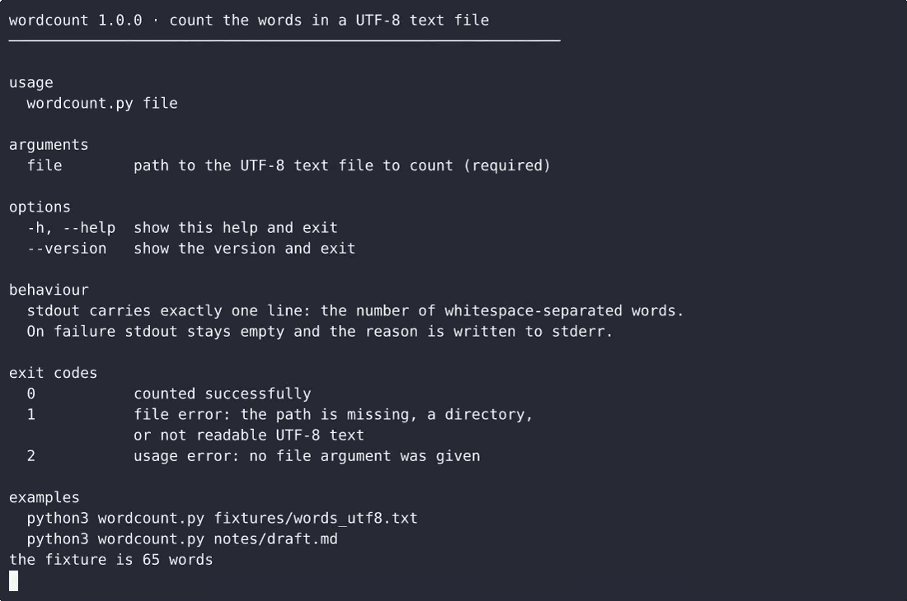

# wordcount CLI — complete Full-stack app command-line tool example app

**wordcount CLI** is Apache-2.0-licensed and fully open-source: a command-line tool written in Full-stack app that you can run, modify, and ship commercially without restrictions. Build a single-file Python command-line tool that takes a text file path, counts whitespace-separated words, and prints the total to stdout, with clear usage and error messages for bad input. Grab wordcount CLI from this repo and self-host it, or [remix it on cenius.ai](https://cenius.ai/marketplace/p/wordcount-cli-5?ref=gh&utm_campaign=wordcount-cli-webapp-5) — the platform grants full rebrand rights on every change.


[](LICENSE)  [](https://cenius.ai)

[](https://cenius.ai/marketplace/p/wordcount-cli-5?ref=gh&utm_campaign=wordcount-cli-webapp-5)

> **▶ [Open & edit in cenius.ai](https://cenius.ai/marketplace/p/wordcount-cli-5?ref=gh&utm_campaign=wordcount-cli-webapp-5)** — one click to an editable workspace: describe changes in plain English, get an instant preview, one-click deploy and host. Modifications made on the platform come with full rebrand & relicense rights.

_Local clone? See [Quick start](#quick-start) below. cenius.ai is the zero-setup path._

## Demo


📽 **[Demo video on cenius.ai](https://cenius.ai/marketplace/p/wordcount-cli-5?ref=gh&utm_campaign=wordcount-cli-webapp-5)** — the complete run-through · [MP4](.github/media/demo.mp4)

## Screenshots

 

## Usage guide

Task-oriented walkthroughs of everything the tool actually does. Every command
below was run from a clean checkout of this project.

### Count a file

```bash
$ python3 wordcount.py fixtures/words_utf8.txt
65
```

The number goes to stdout, on its own line, and the exit code is `0`. Nothing
else is printed.

### Count inside a script

Because stdout carries only the integer, a shell script can capture it directly:

```bash
$ count=$(python3 wordcount.py fixtures/words_utf8.txt)
$ echo "captured: $count"
captured: 65
```

Trust the exit code instead of parsing the text:

```bash
if count=$(python3 wordcount.py "$draft"); then
    echo "$draft: ${count} words"
else
    echo "$draft: could not be counted (see the error above)" >&2
fi
```

The `else` branch runs for a missing file, a directory, an unreadable file or a
file that is not UTF-8 — in all those cases stdout stays empty, so `count` is
never a half-written number.

### Empty and whitespace-only files

```bash
$ python3 wordcount.py fixtures/empty.txt
0
$ python3 wordcount.py fixtures/whitespace_only.txt
0
```

A file with no words is a success: `0` on stdout, exit code `0`.

### Non-ASCII text and non-ASCII whitespace

The file is decoded as UTF-8 and split on runs of Unicode whitespace, so words
and separators outside ASCII behave the same as ASCII ones:

```bash
$ printf 'caf\303\251\302\240na\303\257ve\302\240\346\227\245\346\234\254\350\252\236\n' > /tmp/x.txt
$ python3 wordcount.py /tmp/x.txt
3
```

_Full guide: [`USAGE.md`](USAGE.md)_

## Features

- Count words in a file
- Usage and file-error handling

## Quick start

```bash
./install.sh   # installs dependencies + seeds demo data
```

See [`INSTALL.md`](INSTALL.md) for full setup and usage instructions.

## Architecture

The repository contains 16 files of Full-stack app source, organised under `fixtures/`, `tests/`. Kick off `./install.sh` to pull packages and seed the database, then the app is up. Installation walkthrough: [`INSTALL.md`](INSTALL.md).

## FAQ

### How do I run wordcount CLI on my own server?

Clone this repository and run `./install.sh`, then start the app as described in [`INSTALL.md`](INSTALL.md). wordcount CLI is fully self-hostable — no external services are required to try it.

### Can I build a business on wordcount CLI?

It is. Apache-2.0 licensing means you can build a product on it, sell it, or use it inside a company with no fees. Details: [LICENSE](LICENSE).

### How do I customise wordcount CLI's branding?

Yes. You can edit the source directly under the MIT license, or [remix it on cenius.ai](https://cenius.ai/marketplace/p/wordcount-cli-5?ref=gh&utm_campaign=wordcount-cli-webapp-5) — the platform route grants full rebrand and relicense rights over your derivative.

### What if I want to add features to wordcount CLI without coding?

The easiest route: [visit the project on cenius.ai](https://cenius.ai/marketplace/p/wordcount-cli-5?ref=gh&utm_campaign=wordcount-cli-webapp-5), tell the platform what to change, and collect the updated build. No source-editing needed.

### Which technology stack does wordcount CLI use?

The app is built with Full-stack app. What you see in this repo is the full production source, demo data included. Highlights include count words in a file.

## License & rebranding

Released under the [Apache License 2.0](LICENSE) (© 2026 Cenius AI) — free for personal and commercial use. The Cenius name/logo are trademarks (see NOTICE).

**Need a customized version?** [Remix this app on cenius.ai](https://cenius.ai/marketplace/p/wordcount-cli-5?ref=gh&utm_campaign=wordcount-cli-webapp-5) — modifications made on the platform come with **full rebrand & relicense rights** over your derivative.

## Built with cenius.ai

This entire application — code, design, seeded demo data — was generated on **[cenius.ai](https://cenius.ai)** from a plain-English description.

- 🚀 [Build your own app on cenius.ai](https://cenius.ai)
- 🎛️ [Remix wordcount CLI on the marketplace](https://cenius.ai/marketplace/p/wordcount-cli-5?ref=gh&utm_campaign=wordcount-cli-webapp-5) — open it in a workspace, prompt for changes, and ship your own version.

More open-source apps: [the Cenius-ai catalog](https://github.com/Cenius-ai) · [showcase index](https://github.com/Cenius-ai/showcase)
